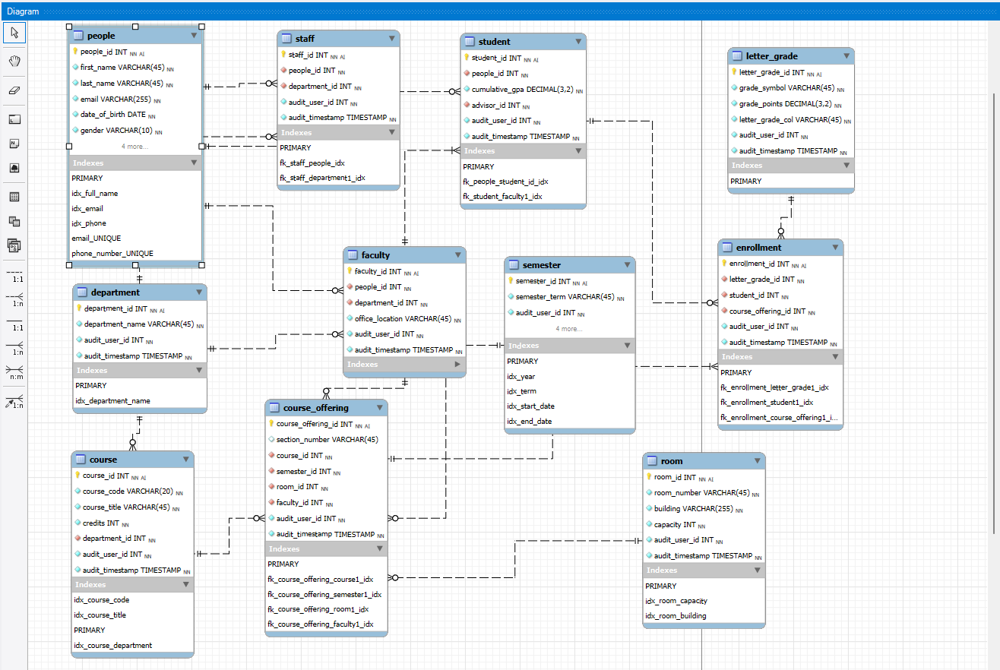

# 🎓 College Database Project (Version 2.0)

This project defines an improved relational schema and sample application logic for managing a college academic system using **MySQL**. It includes support for students, faculty, staff, departments, courses, enrollment, scheduling, and more — with an extensible design in mind.

Designed for use with **MySQL Workbench** the system emphasizes normalization, key relational constraints, and extensibility for real-world academic use cases.

---

## 📑 Table of Contents

1. [🗃️ Entities and Relationships](#️-entities-and-relationships)

   * [📌 Main Tables](#-main-tables)
2. [📋 Table Structure Summary](#-table-structure-summary)

   * [`Student`](#student)
   * [`Faculty`](#faculty)
   * [`Course`](#course)
   * [`Enrollment`](#enrollment)
   * [`Department`](#department)
   * [`Semester`](#semester)
   * [`Room`](#room)
   * [`Course_Offering`](#course_offering)
3. [🔐 Constraints & Notes](#-constraints--notes)
4. [📂 Files](#-files)
5. [🚀 Getting Started](#-getting-started)
6. [📈 Future Enhancements (Version 3+)](#-future-enhancements-version-3)
7. [👥 Contributors](#-contributors)
8. [💬 Feedback or Contributions?](#-feedback-or-contributions)

---

## 🗃️ Entities and Relationships

### 📌 Main Tables

| Table             | Description                                                             |
| ----------------- | ----------------------------------------------------------------------- |
| `Student`         | Contains student records and key attributes (e.g. major, year).         |
| `Faculty`         | Faculty details including department affiliation.                       |
| `Course`          | Master list of courses with course code and title.                      |
| `Enrollment`      | Records of student enrollment in course offerings and assigned grades.  |
| `Department`      | Department definitions, e.g. CS, Math.                                  |
| `Semester`        | Academic terms (e.g. Fall 2025) with start and end dates.               |
| `Room`            | Physical room details with capacity.                                    |
| `Course_Offering` | Maps a course to a semester, room, and instructor (section-level info). |

---

## 📋 Table Structure Summary

### `Student`

* `student_id`: Primary Key
* `first_name`, `last_name`, `email`
* `major`, `year_of_study`

### `Faculty`

* `faculty_id`: Primary Key
* `first_name`, `last_name`, `email`
* `department_id` → FK to `Department`

### `Course`

* `course_id`: Primary Key
* `course_code` (e.g. CS101) — Unique
* `title`, `department_id` → FK

### `Enrollment`

* `enrollment_id`: Primary Key
* `student_id` → FK to `Student`
* `course_offering_id` → FK to `Course_Offering`
* `letter_grade`

### `Department`

* `department_id`: Primary Key
* `name`: Unique

### `Semester`

* `semester_id`: Primary Key
* `name`, `start_date`, `end_date`

### `Room`

* `room_id`: Primary Key
* `building`, `room_number`, `capacity`

### `Course_Offering`

* `offering_id`: Primary Key
* `course_id`, `semester_id`, `section`
* `faculty_id`, `room_id`
* Unique Constraint: (`course_id`, `semester_id`, `section`)

---

## 📊 Built-in Views

These read-only views give quick answers to common questions for students, advisors, and department staff. They’re designed to be simple, fast to scan, and easy to filter by term.

---

## 1) 📚 `course_catalog` (Course Catalog)

**Purpose:** One place to browse **what’s offered**, **who teaches it**, **when**, and **where** — helpful for registration planning and departmental audits.

**Columns (as defined):**
- `course_code`
- `course_title`
- `credits`
- `department_name`
- `instructor` *(full name from People)*
- `semester_term`
- `start_date`, `end_date`, `year`
- `room_number`, `building`

**Notes:** Includes only courses that have an associated **course offering** (joined to faculty, semester, and room).  

---

## 2) 🎓 `enrollment_summary` 

**Purpose:** Quickly see **how full** a section is and its **average grade** signal per offering/term.

**Columns (as defined):**
- `course_code`
- `course_title`
- `semester_term`, `year`
- `instructor`
- `student_id` 
- `avg_grade` *(average of `letter_grade.grade_points`)*
- `capacity` *(room capacity)*

**Notes:** Aggregates enrollments and letter grades by course offering; currently grouped by `course_code`.  

---

## 3) 👩‍🏫 `faculty_directory` 

**Purpose:** A simple faculty directory augmented with **department**, **current/linked course titles**, and **room location** context.

**Columns (as defined):**
- `faculty_id`
- `full_name`
- `email`
- `department_name`
- `office_location`
- `course_title` 
- `room_number`, `building`

**Notes:** Joins across faculty → people/department and through course/course_offering to include teaching context.  

---

### 4) 🧭 `advisor_snapshot` — Advisor Advisee Snapshot (per term)

**Purpose:** Give advisors a per-term snapshot of each advisee with identity, standing, course load, and quick contact info. Use it to see who’s taking how many classes, total credits this term, and who may need outreach.

**Columns (as defined):**
- `faculty_id` 
- `advisor_name` 
- `student_id` 
- `student_name`  
- `status` — student standing (e.g., Good Standing / Probation)  
- `semester_term`, `year`  
- `courses_enrolled` — number of enrollments this term  
- `total_credits_this_term` — sum of course credits this term  
- `cumulative_gpa` — student’s cumulative GPA  
- `email` 

**Intended use:** Advisor dashboards, advisee check-ins, and quick pre-meeting reviews.

---

## 🔐 Constraints & Notes

* ✅ **Referential Integrity**: All FKs are enforced via `FOREIGN KEY` constraints
* ✅ **Data Consistency**: Constraints like `CHECK (capacity > 0)` included
* ✅ **Uniqueness**: Keys such as `course_code`, department names, and offering sections are unique
* ❗ **Role Separation**: Students enroll, faculty teach — no overlap
* ❗ **Capacity Logic**: Room capacity constraints can be enforced via future triggers

---

## 📂 Files

| File              | Description                                     |
| ----------------- | ----------------------------------------------- |
| `schema_code.sql` | SQL script to create the entire database schema |
| `create_data.sql` | Script to populate sample records for testing   |
| `py_script.py`    | Python script for interacting with the database |
| `college_v1.mwb`  | MySQL Workbench model (original/base version)   |
| `college_v2.mwb`  | Updated MWB model representing Version 2        |
| `eer.png`         | Visual EER diagram (exported image)             |
| `todo.md`         | Developer notes for future improvements         |
| `README.md`       | This documentation file                         |

---

## 🚀 Getting Started

1. **Clone the repository**

```bash
git clone https://github.com/RileyTeeter/College_V2.git
cd College_V2
```

2. **Set up the schema**

   * Create a new database in MySQL
   * Run `schema_code.sql` to create tables and constraints
   * Run `create_data.sql` to insert sample data

3. **Use MySQL Workbench** (Optional)

   * Open `college_v2.mwb` to inspect and modify schema visually
   * Refer to `eer.png` if MySQL Workbench is unavailable

4. **Run the Python Script**

   * Make sure your DB credentials are correct in `py_script.py`
   * Run using Python 3:

     ```bash
     python py_script.py
     ```

---

## 🖼️ EER Diagram

The database design is visualized below. This EER diagram maps all entities and relationships in Version 2.

📍 `assets/eer.png`



---

## 📈 Future Enhancements (Version 3)

The following features are planned or proposed for future development:

* 🔄 Triggers to enforce constraints (e.g., max room capacity)
* 🧠 Prerequisite relationships between courses
* 🧾 Student transcripts via SQL Views
* 📅 Time-slot & room scheduling logic
* ✅ Role-based permissions & user types
* 🧮 Grade calculation & GPA logic
* 📊 Stored procedures for registration, grading, etc.


---

## 👥 Contributors

* [Riley Teeter](https://github.com/RileyTeeter)
* [Enoch Atuahene](https://github.com/Typher7)

---

## 💬 Feedback or Contributions?

Pull requests and issue reports are welcome. If you’d like to contribute features, optimizations, or scripts, feel free to fork the project and submit your work via PR!
